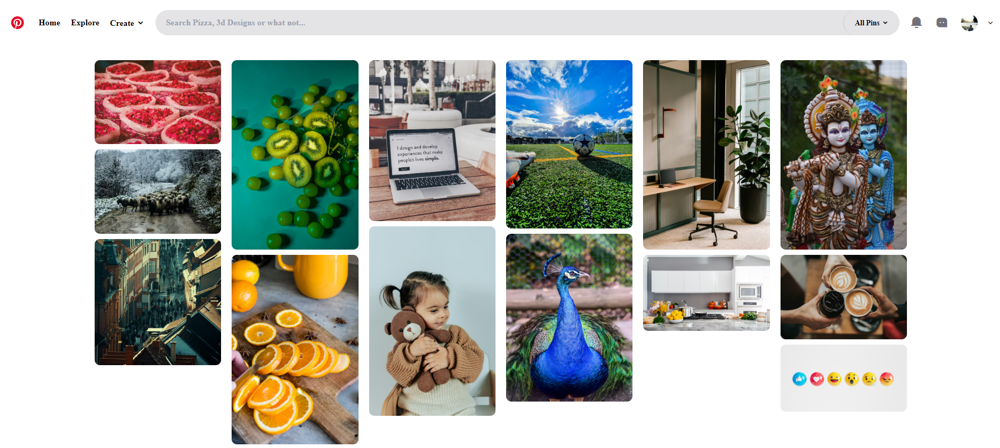
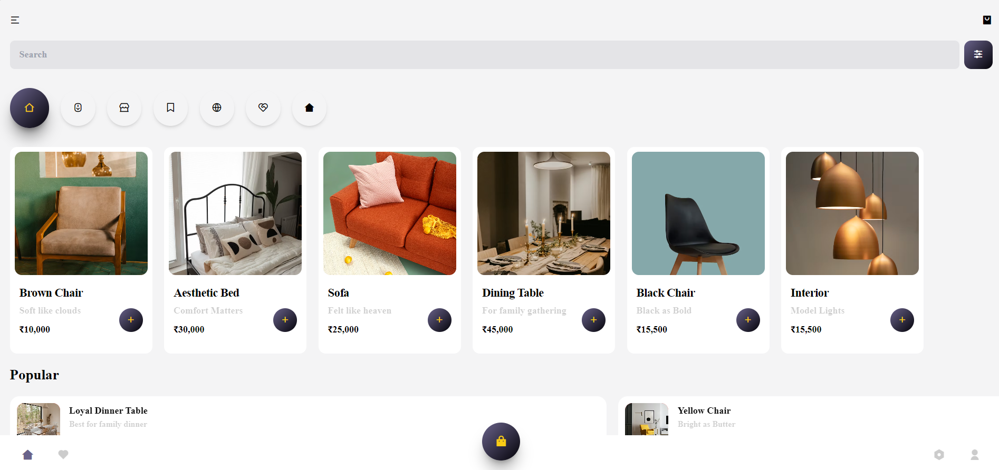
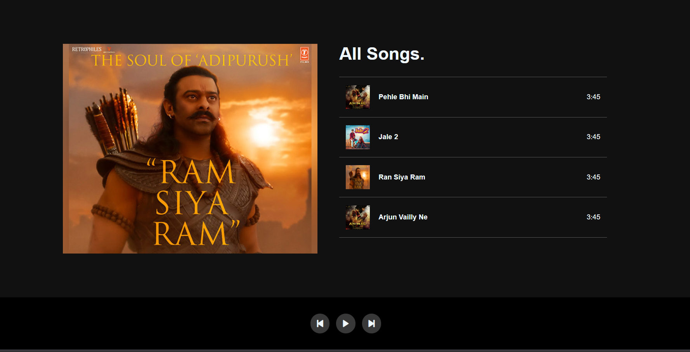

# JavaScript Practice Projects

This repository contains a collection of mini projects built while learning and practicing core JavaScript concepts.  
The focus of these projects is to strengthen fundamentals through hands-on implementation and UI-based logic.

---

## 📁 Projects Included

### 1️⃣ Image Filter Gallery
A Pinterest-style image gallery where users can filter images based on categories.

**Key concepts practiced:**
- DOM manipulation
- Event handling
- Dynamic filtering logic
- UI interaction

📸 Screenshot:  


---

### 2️⃣ Shopping Cart
A basic shopping platform layout where products can be added to a cart and viewed dynamically.

**Key concepts practiced:**
- Add-to-cart functionality
- Dynamic rendering of cart items
- State handling using JavaScript
- Event-driven UI updates

📸 Screenshot:  


---

### 3️⃣ Music Player
A simple browser-based music player that allows users to play, pause, and switch between songs.

**Key concepts practiced:**
- Audio control
- Play / pause / next / previous functionality
- Managing active state
- Event listeners

📸 Screenshot:  


---

### Project Structure

```
js-practice-projects/
│
├── image-filter-gallery/
│   ├── index.html
│   ├── style.css
│   └── script.js   
│
├── shopping-cart/
│   ├── index.html
│   ├── style.css
│   └── script.js
│
├── music-player/
│   ├── index.html
│   ├── style.css
│   └── script.js
│
├── screenshots/
│   ├── image-filter-gallery.png
│   ├── add-to-cart-feature.png
│   └── music-player.png
│
├── .gitignore
└── README.md
```
---

## 🧠 Learning Goals
- Strengthen JavaScript fundamentals
- Improve logical thinking and DOM control
- Build confidence by completing small, functional projects
- Follow a project-driven learning approach

---

## 🚀 Future Improvements
- Enhance UI and responsiveness
- Add more features (search, progress bar, quantity control, etc.)
- Refactor code for better readability
- Add more JavaScript and AI-related projects

---

## 📌 Note
These projects are built for learning purposes and will be improved as I continue exploring AI and web technologies.
